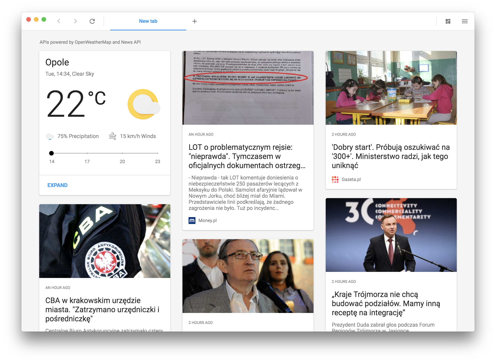

<p align="center">
  
</p>

<div align="center">
  <h1>Wexond</h1>

[](https://discord.gg/yAA8DdK)
[](https://travis-ci.org/wexond/wexond)
[](https://ci.appveyor.com/project/Sential/wexond)

Wexond is a web browser built on top of `Electron`, `React` and `styled-components`.

</div>

# Features

- **Built-in ad-block** Browse the web without any ads.
- **Beautiful and minimalistic UI** The tabs and address bar are located in the same toolbar to take less space.
- **Tab groups** Easily group tabs to tab groups and access them very fast.
- **Expanded new tab page** Have all information such as news, weather or currency in only one page!
- **Partial support for Chrome extensions** Install some extensions from Chrome Web Store (see https://github.com/wexond/wexond/issues/110)

<a href="https://www.patreon.com/bePatron?u=12270966">
	
</a>

# Screenshots



# [Downloads](https://github.com/wexond/wexond/releases)

All binaries are located in the [Releases page](https://github.com/wexond/wexond/releases).

# [Roadmap](https://github.com/wexond/wexond/projects)

We still have a lot of things to do, to make Wexond better and better. This is just a beginning. So to improve our web browser we have created a roadmap so that you can see the next features and improvements.

# [Supported WebExtensions APIs](https://github.com/wexond/wexond/issues/110)

There is a lot of APIs, but we are only two very young programmers, so any help would be really appreciated and welcomed.

# Contributing

We really appreciate any changes and improvements, so feel free to open pull requests! If you have found any issues, please report them. This would really help us making the browser even better!

If you want to contribute, check our [Contributing guidelines](CONTRIBUTING.md) and [Code Of Conduct](CODE_OF_CONDUCT.md).

## Development

If you want to develop Wexond, you will need to run some commands, but don't worry, we will explain you everything. Please make sure you have installed [`Node.js`](https://nodejs.org/en/). Also, we assume you have cloned the repository.

First, you will need to install all needed dependencies to run and build Wexond by typing this simple command:

```bash
$ npm install
```

If you have installed all dependencies successfully, just type

```bash
$ npm run watch
```

This will watch code for changes

and to start Wexond, type

```bash
$ npm start
```

### Other commands

#### Usage:

```bash
$ npm run <command>
```

| Command            | Description                                 |
| ------------------ | ------------------------------------------- |
| `build-production` | Bundles Wexond's source in production mode. |
| `compile-win32`    | Compiles Wexond binaries for Windows.       |
| `compile-darwin`   | Compiles Wexond binaries for macOS.         |
| `compile-linux`    | Compiles Wexond binaries for Linux.         |
| `electron-rebuild` | Rebuilds all dependencies for `Electron`.   |
| `lint`             | Lints code.                                 |
| `lint-fix`         | Fixes eslint errors if any                  |
| `start`            | Starts Wexond.                              |
| `watch`            | Watches code for changes                    |

## Documentation

> At this moment there are no docs for the theming system.

Guides and the API reference are located in [`docs`](docs).
It also contains documents describing how to use the browser, and create themes.
