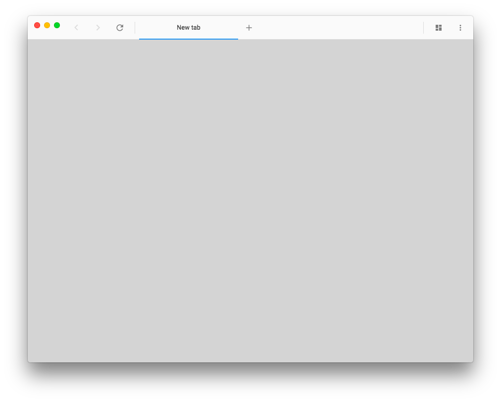
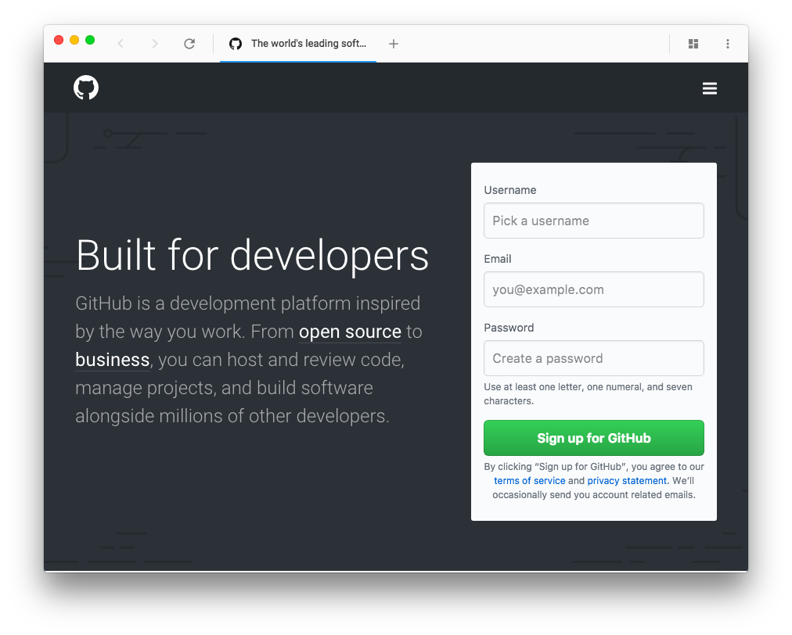

<p align="center">
  
</p>

<div align="center">
  <h1>Wexond</h1>

  [](https://discord.gg/yAA8DdK)
  [](https://travis-ci.org/wexond/wexond)
  [](https://ci.appveyor.com/project/Sential/wexond)

  Wexond is a *free*, *open-source* and *extensible* web browser with material design, which lets you browse the web without any ads thanks to built-in ad blocker. The API in extensions system lets you to extend browser by additional functionality. Wexond works on each desktop platform, thanks to `Electron`. For building the browser interface, we use `React` which is useful framework for creating components, `Sass` for styling them and `MobX` for managing states. We also use Material Design components from our framework [`nersent-ui`](https://github.com/nersent/nersent-ui). To manage plugins we use our [`wexond-package-manager`](https://github.com/wexond/wexond-package-manager) (wpm).
</div>


# Contributing

We really appreciate any changes and improvements, so feel free to open pull requests! If you have found any issues, please report them. This would really help us making the browser even better!

## Development

If you want to develop Wexond, you will need to run some commands, but don't worry, we will explain you everything. Please make sure that you have installed [`Node.js`](https://nodejs.org/en/). Also, we assume you have cloned the repository.

First, you will need to install all needed dependencies to run and build Wexond by typing this simple command:

```bash
$ npm install
```

If you have installed all dependencies successfully, just type

```bash
$ npm run watch
```

This will watch code for changes, and start Wexond.

### Other commands

#### Usage:

```bash
$ npm run <command>
```

| Command            | Description                                 |
| ------------------ | ------------------------------------------- |
| `build-production` | Bundles Wexond's source in production mode. |
| `compile-win32`    | Builds Wexond binaries for Windows.         |
| `compile-darwin`   | Builds Wexond binaries for macOS.           |
| `compile-linux`    | Builds Wexond binaries for Linux.           |
| `electron-rebuild` | Rebuilds all dependencies for `Electron`.   |
| `lint`             | Lints code and fixes if there are errors.   |
| `start`            | Starts Wexond.                              |
| `watch`            | Watches code for changes and starts Wexond  |

## Documentation

Guides and the API reference are located in [`docs`](https://github.com/Nersent/Wexond/docs).
It also contains documents describing how to use the browser, and create extensions.

## Screenshots




