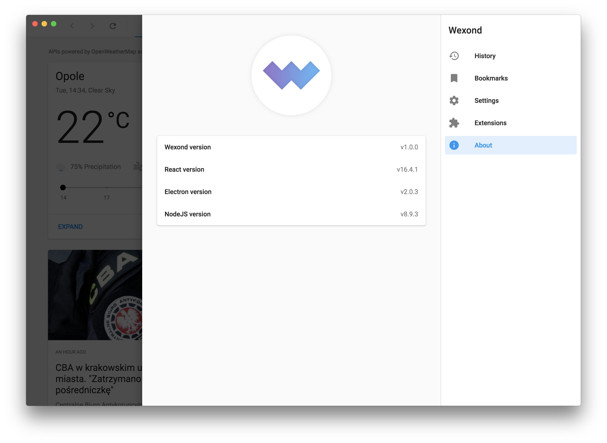
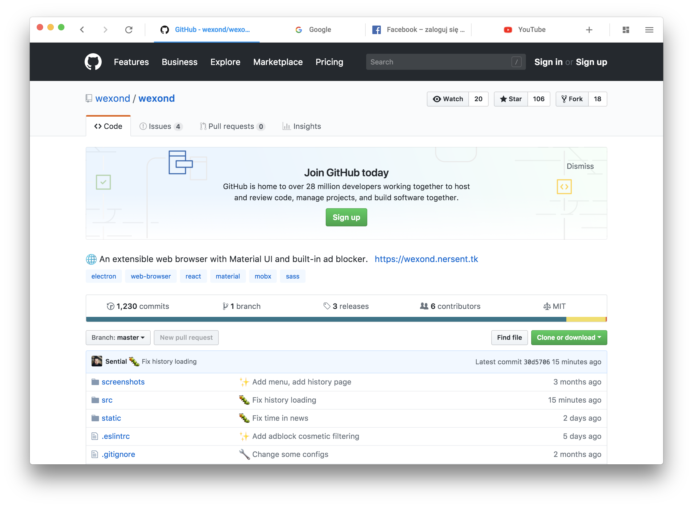

<p align="center">
  
</p>

<div align="center">
  <h1>Wexond</h1>

[](https://discord.gg/yAA8DdK)
[](https://travis-ci.org/wexond/wexond)
[](https://ci.appveyor.com/project/Sential/wexond)

Wexond is a _free_, _open-source_ and _extensible_ web browser with material design, which lets you browse the web without any ads thanks to built-in ad blocker. The API in extensions system lets you to extend the browser by additional functionality and customize it to your own needs. Wexond works on each desktop platform, thanks to `Electron`. For building the browser interface, we use `React`, `styled-components` and `MobX`. We also use Material Design components from our framework [`nersent-ui`](https://github.com/nersent/nersent-ui). For simple extensions and themes management, we use [`wexond-package-manager`](https://github.com/wexond/wexond-package-manager) (wpm).

</div>

# Screenshots






# Contributing

We really appreciate any changes and improvements, so feel free to open pull requests! If you have found any issues, please report them. This would really help us making the browser even better!

## Development

If you want to develop Wexond, you will need to run some commands, but don't worry, we will explain you everything. Please make sure you have installed [`Node.js`](https://nodejs.org/en/). Also, we assume you have cloned the repository.

First, you will need to install all needed dependencies to run and build Wexond by typing this simple command:

```bash
$ npm install
```

If you have installed all dependencies successfully, just type

```bash
$ npm run watch
```

This will watch code for changes

and to start Wexond, type

```bash
$ npm start
```

### Other commands

#### Usage:

```bash
$ npm run <command>
```

| Command            | Description                                 |
| ------------------ | ------------------------------------------- |
| `build-production` | Bundles Wexond's source in production mode. |
| `compile-win32`    | Compiles Wexond binaries for Windows.       |
| `compile-darwin`   | Compiles Wexond binaries for macOS.         |
| `compile-linux`    | Compiles Wexond binaries for Linux.         |
| `electron-rebuild` | Rebuilds all dependencies for `Electron`.   |
| `lint`             | Lints code.                                 |
| `lint-fix`         | Fixes eslint errors if any                  |
| `start`            | Starts Wexond.                              |
| `watch`            | Watches code for changes                    |

## Documentation

> For this moment there is no `docs` folder

Guides and the API reference are located in [`docs`](https://github.com/Nersent/Wexond/docs).
It also contains documents describing how to use the browser, and create extensions.
