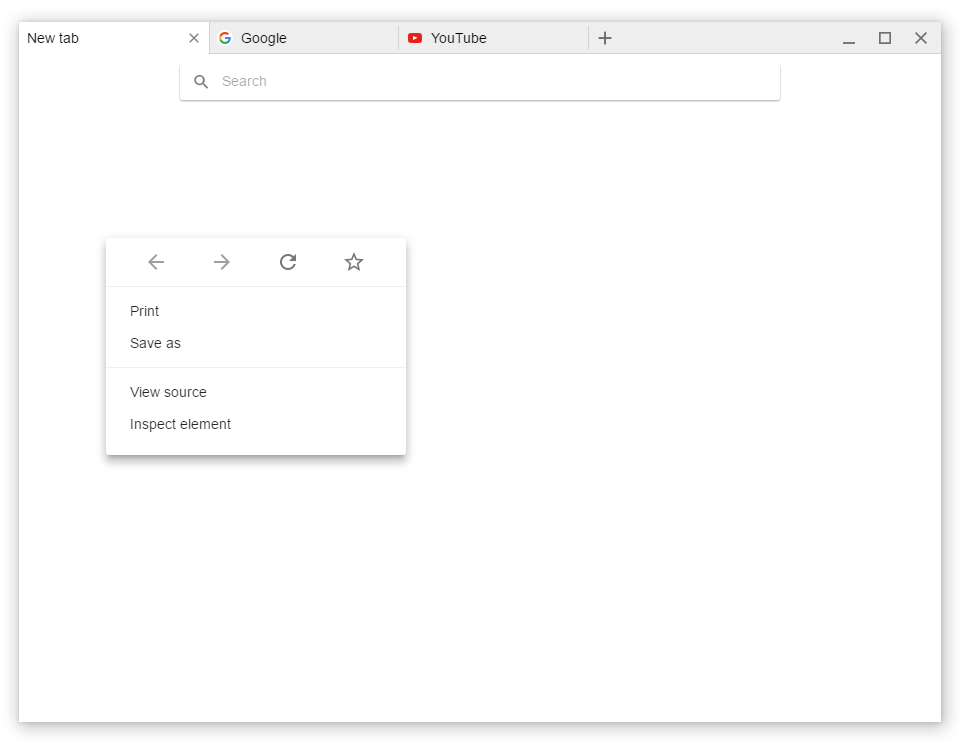

<h1 align="center"></h1>

[](https://travis-ci.org/Nersent/Wexond)
[](http://standardjs.com)
[](https://david-dm.org/nersent/wexond)
[](https://david-dm.org/nersent/wexond?type=dev)

[](https://github.com/feross/standard)

# Wexond
Extensible web browser with material UI made with [`Electron`](https://github.com/electron/electron) and [`React`](https://github.com/facebook/react), that contains many innovative features.

## Questions and issues
If you noticed a bug, please report it on [Github issue tracker](https://github.com/Nersent/Wexond/issues).

## Documentation
Guides and the API reference are located in
[`docs`](https://github.com/Nersent/Wexond/tree/refactor/docs).
It also contains documents describing how to use the browser, and create extensions.

## Running
[]()

### Installing
To install all dependencies for `Wexond`, use [`npm`](https://docs.npmjs.com/):
```sh
npm install
```

### Running in dev mode
To run `Wexond` in developer mode, use these commands:
```sh
npm run browser
npm run applets
npm start
```
or on `Windows` you can run `compile.bat` and `start.bat`.

## Screenshots

